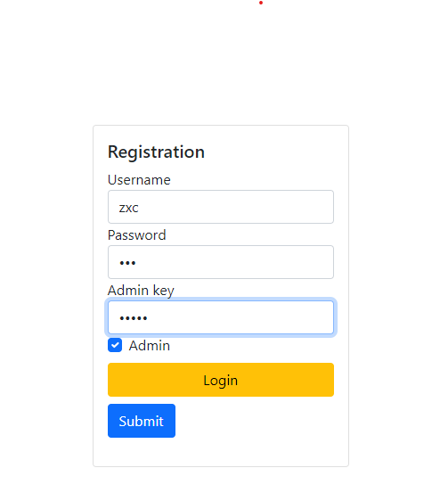
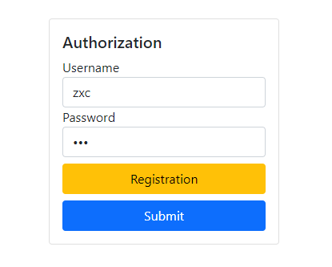
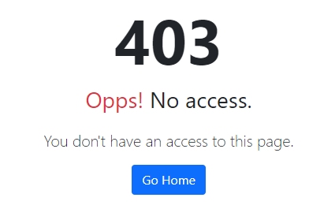
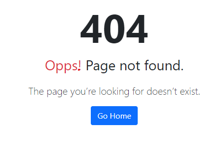

# Пр 6

Вариант 11: Мебель.

## Инструкция по запуску

Убедитесь в наличии на вашем устройстве [JDK](https://www.oracle.com/java/technologies/downloads/#jdk17-windows)

```
git clone https://github.com/infern397/RKIS-6.git
cd RKIS-6
psql -U postgres -c "CREATE DATABASE furniture_bd;"
sh mvnw package
java -jar target/mvc-0.0.1-SNAPSHOT.jar
```
Открываем в браузере [главную страницу](http://127.0.0.1:8080)

_Для сборки необходим [Maven](https://maven.apache.org/download.cgi)_

## Демонстрация


При регистрации можно указать "ключ администратора", чтобы получить права админа. 
**Ключ - admin**



Далее авторизируемся



Страница про отсутствии доступа


Неизвестная страница